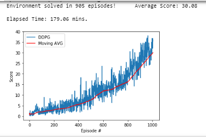

# Summary
This project is my second project on [Udacity's Deep Reinforcement Learning Nanodegree (Facebook PyTorch Nanodegree Scholarship Phase 3)](https://www.udacity.com/course/deep-reinforcement-learning-nanodegree--nd893). This project uses a Deep Deterministic Policy Gradients (*DDPG*) Network to train a double-jointed arm to move to target locations.

# Project Details
The environment the first verison of the `Reacher` enviroment, which is an extension of Unity’s [UnityEnvironment](https://github.com/Unity-Technologies/ml-agents/blob/master/docs/Installation.md). The `Reacher` environment has different versions for [Linux](https://s3-us-west-1.amazonaws.com/udacity-drlnd/P2/Reacher/one_agent/Reacher_Linux.zip), [Windows (32-bit)](https://s3-us-west-1.amazonaws.com/udacity-drlnd/P2/Reacher/one_agent/Reacher_Windows_x86.zip), [Windows (64-bit)](https://s3-us-west-1.amazonaws.com/udacity-drlnd/P2/Reacher/one_agent/Reacher_Windows_x86_64.zip) and [MacOSX](https://s3-us-west-1.amazonaws.com/udacity-drlnd/P2/Reacher/one_agent/Reacher.app.zip). The following screenshot shows the environment set-up:

The state is a [numpy](https://numpy.org/) array of length 33.

The action is how the agent reacts to the environment. 

The environment is considered ‘solved’ when the ___moving__ average (arithmetic mean) score over the last 100 episodes is greater than or equal to __30.0__.

# Directions
Complete the following steps interact with this project:

1. Determine your operating system (*OS*) 
   - Determine your number of bits (__only__ if you are using Windows) - click [here for help from Microsoft](https://support.microsoft.com/en-us/help/827218/how-to-determine-whether-a-computer-is-running-a-32-bit-version-or-64)
2. Click the relevant hyperlink from the following list
   - [Linux]( https://s3-us-west-1.amazonaws.com/udacity-drlnd/P2/Reacher/one_agent/Reacher_Linux.zip)
   - [Windows (32-bit)](https://s3-us-west-1.amazonaws.com/udacity-drlnd/P2/Reacher/one_agent/Reacher_Windows_x86.zip)
   - [Windows (64-bit)](https://s3-us-west-1.amazonaws.com/udacity-drlnd/P2/Reacher/one_agent/Reacher_Windows_x86_64.zip)
   - [MacOSX](https://s3-us-west-1.amazonaws.com/udacity-drlnd/P2/Reacher/one_agent/Reacher.app.zip)
3. Open `Continuous_Control.ipynb` using Jupyter Notebook (or Jupyter Lab)
4. Click **Cell>Run All**
5. Be patient as the magic happens
